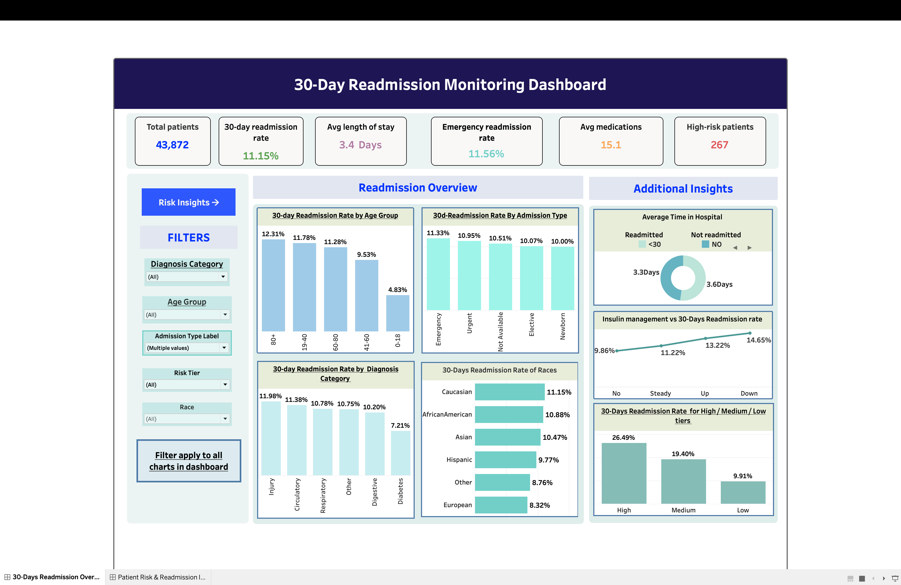
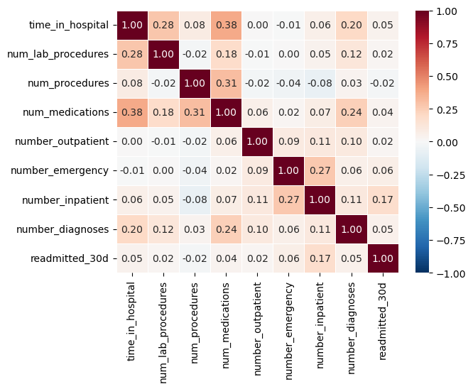
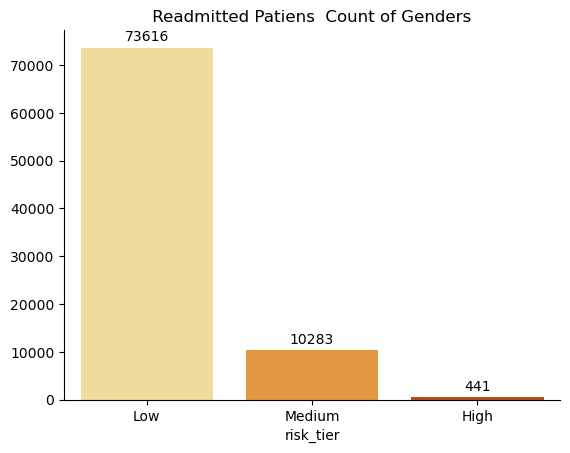

# 🏥 Hospital Readmission Risk Analysis & Interactive Tableau Dashboard

### Identifying Early Readmission Risk Across 84,340 Hospital Encounters


---

## 📌 Project Overview

This end-to-end data analytics project analyses **84,340 diabetic patient encounters** from 130 US hospitals (1999–2008) to identify the key drivers of **30-day hospital readmission** — a critical quality metric directly tied to hospital performance scores, penalties, and patient outcomes.

The project is structured across **3 modules**: Python (cleaning + EDA), SQL (querying), and Tableau (dashboard), delivering actionable clinical insights for hospital management.

> **Core question:** *Which diabetic patients are most likely to return to hospital within 30 days — and which factors matter most?*

---

## 📊 Live Dashboards

### Dashboard 1 — 30-Day Readmission Monitoring Overview


### Dashboard 2 — Patient Risk & Readmission Insights


🔗 **[View Live on Tableau Public →](https://public.tableau.com/app/profile/badal.singh.dashmer/viz/Hospital_30-Days_Readmission_Monitoring_Dashboard/30-DaysReadmissionOverview?publish=yes)**

---

## 🔍 Key Findings — Real Numbers from the Data

| # | Finding | Value |
|---|---------|-------|
| 1 | **Overall 30-day readmission rate** | **10.95%** — roughly 1 in 9 patients |
| 2 | **Total patients analysed** | **62,155 unique patients**, 84,340 encounters |
| 3 | **Highest-risk age group** | **80+ patients at 12.31%** — nearly 2.5× the rate of 0–18 patients (4.97%) |
| 4 | **Highest-risk diagnosis** | **Injury (12.01%)** followed by Circulatory (11.29%) |
| 5 | **High-risk tier readmission rate** | **26.76%** — nearly 3× the Low tier (9.70%) ✅ Risk model validated |
| 6 | **Polypharmacy impact** | Patients on ≥10 medications: **11.55%** vs 8.91% for others — 30% higher |
| 7 | **Insulin management matters** | Patients with insulin dose changes (Down/Up) have the **highest rates: 13.69% / 12.95%** vs 9.84% for no insulin |
| 8 | **Emergency admissions** lead readmission types at **11.33%** vs Elective at 10.07% |
| 9 | **Gender difference is minimal** | Female: 11.08% vs Male: 10.80% — not a meaningful predictor |
| 10 | **Length of stay difference** | Readmitted: **3.63 days** vs Not Readmitted: **3.31 days** — weak predictor |

---

## 💡 Dashboard Highlights

### Dashboard 1 — Readmission Monitoring Overview
| KPI | Value |
|-----|-------|
| Total Patients | 43,872 |
| 30-Day Readmission Rate | 11.15% |
| Avg Length of Stay | 3.4 Days |
| Emergency Readmission Rate | 11.56% |
| Avg Medications | 15.1 |
| High-Risk Patients | 267 |

**Charts included:**
- 30-Day Readmission Rate by Age Group
- 30-Day Readmission Rate by Admission Type
- 30-Day Readmission Rate by Diagnosis Category
- 30-Day Readmission Rate of Races
- Average Time in Hospital (Readmitted vs Not)
- Insulin Management vs 30-Day Readmission Rate
- Risk Tier Breakdown (High / Medium / Low)

### Dashboard 2 — Patient Risk & Readmission Insights
**Charts included:**
- Readmitted Patients Count by Diagnosis Category (Treemap)
- Age Group × Diagnosis Category Matrix (Highlight Table)
- 30-Day Readmission Rate vs Number of Diagnoses (Line)
- Readmission Rate by Gender (Donut)
- num_medications vs time_in_hospital Scatter

**Filters on both dashboards:** Diagnosis Category · Age Group · Admission Type · Risk Tier · Race

---

## 📸 Sample Visuals

### Correlation Heatmap — Top 3 Predictors of Readmission
> `number_inpatient` (0.19) is the strongest predictor — prior hospitalisation history drives readmission more than anything else.



### Readmission Rate by Age Group
> 80+ patients have the highest rate at 12.31% — nearly 2.5× the rate of patients under 18.


### Risk Tier Validation
> High tier: 26.76% · Medium: 19.24% · Low: 9.70% — the engineered risk model is confirmed by the data.



> 📁 All 10 EDA charts are in the [`visuals/`](visuals/) folder. Full chart code is in the [notebook](notebooks/diabetes_readmission_eda.ipynb).

---

## 🗂️ Project Structure

```
diabetes-readmission-analysis/
│
├── 📓 notebooks/
│   └── diabetes_readmission_eda.ipynb     # Full Python EDA — cleaning, features, charts
│
├── 🗃️ sql/
│   └── SQL_Query.sql                      # 24 SQL queries — exploration + advanced analytics
│
├── 📊 tableau/
│   └── Hospital_30-Days_Readmission_Monitoring_Dashboard.twbx
│
├── 📁 data/
│   ├── diabetic_data.csv                  # Raw dataset (download from UCI — see below)
│   ├── IDS_mapping.csv                    # Admission type / discharge ID mappings
│   └── diabetic_final_data.csv           # Cleaned + engineered dataset used in Tableau
│
├── 📸 visuals/
│   ├── first_dashbord.png
│   ├── second_dashboard.png
│   ├── correlation_heatmap.png
│   ├── readmission_by_age_group.png
│   └── risk_tier_validation.png
│
└── 📄 README.md
```

---

## 🛠️ Tools & Technologies

| Tool | Version | Purpose |
|------|---------|---------|
| **Python** | 3.10 | Core analysis language |
| **Pandas** | 2.0 | Data loading, cleaning, feature engineering |
| **NumPy** | 1.24 | Percentile flags, numerical operations |
| **Seaborn / Matplotlib** | 0.12 | EDA visualisations — bar, box, heatmap, pairplot, line |
| **MySQL** | 8.0 | 24 SQL queries across exploration and advanced analytics |
| **Tableau Public** | 2024 | Two interactive dashboards with 6 KPIs, 12 charts, 5 filters |

---

## 📦 Dataset

| Field | Detail |
|-------|--------|
| **Name** | Diabetes 130-US Hospitals for Years 1999–2008 |
| **Source** | [UCI Machine Learning Repository](https://archive.ics.uci.edu/dataset/296/diabetes+130-us+hospitals+for+years+1999-2008) |
| **Raw size** | 101,766 rows × 50 columns |
| **Final clean size** | 84,340 rows × 23 columns |
| **License** | Public / Open Access — no approval required |

> **Note:** Raw dataset not included due to size. Download `diabetic_data.csv` and `IDS_mapping.csv` from UCI and place in `/data/`.

---

## ⚙️ How to Run

### 1. Clone the repository
```bash
git clone https://github.com/badal-10tech/diabetes-readmission-analysis.git
cd diabetes-readmission-analysis
```

### 2. Install Python dependencies
```bash
pip install pandas numpy seaborn matplotlib jupyter
```

### 3. Add the dataset
Download from [UCI Repository](https://archive.ics.uci.edu/dataset/296/diabetes+130-us+hospitals+for+years+1999-2008) and place both CSV files in `/data/`

### 4. Run the notebook
```bash
jupyter notebook notebooks/diabetes_readmission_eda.ipynb
```

### 5. Run SQL queries
Open `sql/SQL_Query.sql` in MySQL Workbench — the database is `patient_readmission_risk`.

### 6. Open Tableau dashboard
Open `tableau/Hospital_30-Days_Readmission_Monitoring_Dashboard.twbx` in Tableau Desktop or Tableau Public.

---

## 🧹 Data Cleaning Summary

| Step | Action | Impact |
|------|--------|--------|
| Replaced `?` with `NaN` | Standardised missing values | ~10,000 values fixed |
| Dropped `weight`, `payer_code`, `medical_specialty` | >40% missing | 3 columns removed |
| Removed `gender = 'Unknown/Invalid'` | Invalid category | ~3 rows removed |
| Filtered deceased patients (discharge IDs 11,13,14,19,20,21) | Cannot be readmitted | ~1,900 rows removed |
| Dropped `examide`, `citoglipton` | Near-zero variance | 2 columns removed |
| Removed duplicate encounters | Data quality | Minimal |

**Raw: 101,766 rows → Clean: 84,340 rows (~83% retained)**

> 📓 Full cleaning code with comments: [`notebooks/diabetes_readmission_eda.ipynb`](notebooks/diabetes_readmission_eda.ipynb)

---

## 🔧 Feature Engineering — 9 New Columns Created

| Column | Logic | Used For |
|--------|-------|---------|
| `readmitted_30d` | 1 if `readmitted == '<30'`, else 0 | Primary target variable |
| `age_group` | Age brackets → 0-18, 19-40, 41-60, 60-80, 80+ | Demographic analysis |
| `diagnosis_category` | ICD-9 ranges → Circulatory, Respiratory, Injury, Digestive, Diabetes, Other | Clinical grouping |
| `admission_type_label` | Merged `IDS_mapping.csv` to replace IDs | Readable labels |
| `risk_tier` | High: inpatient≥3 AND los≥7 · Medium: either · Low: neither | Risk segmentation |
| `total_prior_visits` | outpatient + emergency + inpatient | Healthcare utilisation |
| `polypharmacy_flag` | 1 if `num_medications >= 10` | Medication complexity |
| `high_procedures_flag` | 1 if `num_lab_procedures` > 75th percentile | Clinical complexity |
| `insulin_flag` | 1 if insulin adjusted (Steady/Up/Down) | Treatment management |

> 📓 Full feature engineering code: [`notebooks/diabetes_readmission_eda.ipynb`](notebooks/diabetes_readmission_eda.ipynb)

---

## 🗃️ SQL Module — 24 Queries

The SQL file covers **3 tiers of complexity** across 24 queries:

### Exploration (Q1–Q6)
- Total encounters vs unique patients
- Readmission value distribution with % share
- Top 10 most frequent diagnosis codes
- Admission type distribution
- Min / Max / Avg time in hospital
- Most-admitted patient (using `HAVING` with subquery)

### Core Analysis (Q7–Q15)
- Overall 30-day readmission rate
- Readmission rate by age group
- Readmission rate by gender
- Readmission rate by admission type
- Top 10 diagnosis codes by readmission rate (min 100 encounters filter)
- AVG time in hospital — readmitted vs not
- AVG medications — readmitted vs not
- AVG prior visits — readmitted vs not
- Readmission rate by race

### Advanced Analytics (Q16–Q24)
- Risk tier assignment using `CASE WHEN`
- Risk tier readmission rate validation
- Insulin management vs readmission rate
- Readmission rate vs number of diagnoses
- Polypharmacy impact using `CASE WHEN`
- Age group × admission type cross-tabulation
- Multi-visit vs single-visit patient readmission comparison (subquery)
- Top 15 highest-risk patients using `ROW_NUMBER()` window function
- Final dataset export for Tableau

**Key SQL concepts demonstrated:** `HAVING`, `COUNT(DISTINCT)`, `CASE WHEN` in aggregations, window functions (`ROW_NUMBER()`), correlated subqueries, scoped `COUNT(*)` vs global subquery, `100.0` for float division

> 🗃️ View all 24 queries: [`sql/SQL_Query.sql`](sql/SQL_Query.sql)

**SQL snippet — top 15 highest-risk patients using window function:**
```sql
select * from 
   (select patient_nbr , 
            age,gender,diagnosis_category,
            readmitted_30d ,
            row_number() over(order by number_inpatient desc , time_in_hospital desc  )
   as rank_number from diabetic_data) t
where rank_number <= 15 ;
```

---

## 📈 Python EDA — Charts Produced

| Chart | Type | Key Finding |
|-------|------|-------------|
| Readmission rate by age group | Bar | 80+ patients highest at 12.31% |
| Readmission rate by diagnosis | Bar | Injury leads at 12.01% |
| Length of stay comparison | Box | Readmitted: 3.63d vs Not: 3.31d — weak predictor |
| Medications comparison | Box | Readmitted patients have more medications |
| Correlation heatmap | Heatmap | `number_inpatient` strongest predictor (0.19) |
| Polypharmacy vs readmission | Bar | 11.55% vs 8.91% — 30% higher risk |
| Insulin flag vs readmission | Bar | Insulin changes associated with higher rates |
| Diagnoses tipping point | Line | Rate exceeds average at 5+ diagnoses |
| Readmission by gender | Count | < 0.3 pp difference — not meaningful |
| Feature pairplot | Pairplot | `number_inpatient` shows clearest group separation |

> 📓 Full chart code with annotations: [`notebooks/diabetes_readmission_eda.ipynb`](notebooks/diabetes_readmission_eda.ipynb)

---

## 🎯 Business Recommendations

Based on findings, the following interventions are prioritised:

1. **Post-discharge follow-up for patients with 3+ prior inpatient visits** — strongest single predictor of readmission
2. **Enhanced discharge planning for patients with 5+ diagnoses** — tipping point where risk exceeds the 10.95% average
3. **Close monitoring of patients with active insulin adjustments** — Down (13.69%) and Up (12.95%) groups have the highest rates
4. **Polypharmacy review before discharge** for patients on 10+ medications — 30% higher readmission risk
5. **Age-targeted care pathways for 80+ patients** — 12.31% rate, highest of all age groups
6. **Prioritise High-risk tier patients** (26.76% readmission rate) for intensive post-discharge support

---

## 📊 Risk Model Validation

The custom `risk_tier` feature was validated against actual readmission rates:

| Risk Tier | Patients | Readmission Rate |
|-----------|----------|-----------------|
| High | 441 | **26.76%** |
| Medium | 10,283 | **19.24%** |
| Low | 73,616 | **9.70%** |

✅ High tier patients are readmitted at **2.76× the rate of Low tier patients** — the model is well-calibrated and clinically meaningful.

---

## 📚 Skills Demonstrated

| Skill | Where Applied |
|-------|--------------|
| Data cleaning at scale | 101,766 rows, 50 columns, multiple missing value strategies |
| Feature engineering | 9 new analytical columns from raw ICD codes and numeric fields |
| Exploratory data analysis | 10 Seaborn charts answering targeted clinical questions |
| SQL analytics (intermediate–advanced) | 24 queries including window functions and subqueries |
| Statistical thinking | Tipping point detection, percentile flags, correlation ranking |
| Dashboard design | 2 Tableau dashboards, 6 KPIs, 12 charts, 5 interactive filters |
| Data storytelling | Translating patient data into ranked clinical recommendations |

---

## 👤 Author

**Badal Singh Dashmer**
📧 badalsinghdashmer@gmail.com
🔗 [LinkedIn](https://www.linkedin.com/in/badal-singh-dashmer-a04856209/)
🐙 [GitHub](https://github.com/badal-10tech)

---

## 📄 License

This project is open source under the [MIT License](LICENSE).

Dataset sourced from the [UCI Machine Learning Repository](https://archive.ics.uci.edu/dataset/296/diabetes+130-us+hospitals+for+years+1999-2008) — publicly available for research and educational use.

---

*If you found this project helpful, please ⭐ star the repository!*
